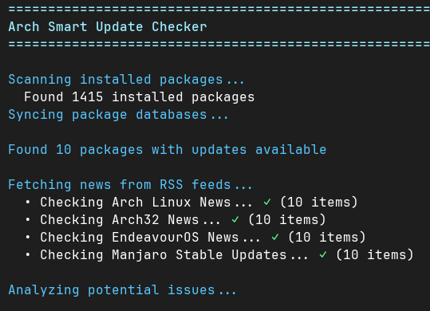
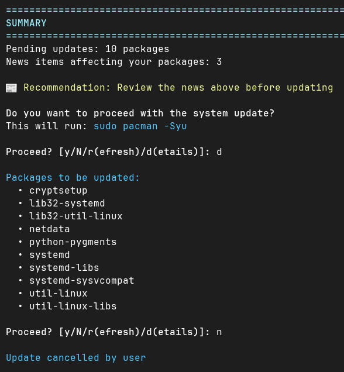
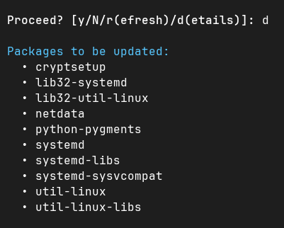

# 🛡️ Arch Smart Update Checker

<div align="center">

[](https://github.com/NeatCode-Labs/arch-smart-update-checker)
[](LICENSE)
[](https://archlinux.org/)
[](https://www.python.org/)

**A smart replacement for `sudo pacman -Syu` that checks Arch Linux news feeds for potential issues before updating your system.**

**Created by [NeatCode Labs](https://neatcodelabs.com)**

</div>

---

## 📋 Table of Contents

- [Features](#-features)
- [Screenshots](#-screenshots)
- [Monitored News Sources](#-monitored-news-sources)
- [Installation](#-installation)
- [Usage](#-usage)
- [How It Works](#️-how-it-works)
- [Package Detection](#-package-detection)
- [Cache Management](#-cache-management)
- [Requirements](#-requirements)
- [Troubleshooting](#-troubleshooting)
- [Contributing](#-contributing)
- [License](#-license)

## ✨ Features

- 📰 **News Feed Monitoring**: Checks multiple Arch Linux news RSS feeds for potential issues
- 📦 **Package Analysis**: Compares your installed packages against warnings in news feeds
- 🎯 **Smart Distribution Detection**: Automatically detects your Arch-based distro and monitors relevant feeds
- 🎨 **User-Friendly Interface**: Colored terminal output with clear warnings and recommendations
- ⚡ **Caching**: Caches news feeds for 1 hour to reduce network requests
- 🔄 **Interactive Prompts**: Allows you to review warnings and decide whether to proceed

## 📸 Screenshots

<div align="center">

### 🔍 Scanning System and Checking Updates


### 📰 News Analysis and Package Matching


### ✅ Safe Update Summary


</div>

## 📡 Monitored News Sources

The tool intelligently detects your distribution and monitors relevant feeds:

### Always Monitored:
- 🏛️ **Arch Linux News** - Official Arch Linux announcements
- 💾 **Arch32 News** - News for 32-bit architecture support

### Distribution-Specific (only if detected):
- 🚀 **EndeavourOS News** - Only checked on EndeavourOS systems
- 🍃 **Manjaro Stable Updates** - Only checked on Manjaro systems

## 🚀 Installation

### 1. Clone the Repository
```bash
git clone https://github.com/NeatCode-Labs/arch-smart-update-checker.git
cd arch-smart-update-checker
```

### 2. Run the Setup Script
```bash
./setup.sh
```

This will:
- ✅ Check and install Python dependencies (`feedparser`, `colorama`)
- 🔧 Add convenient alias to your `.bashrc`
- 🎯 Auto-detect your distribution

### 3. Reload Your Shell
```bash
source ~/.bashrc
```

## 📖 Usage

### Basic Usage
Instead of running `sudo pacman -Syu`, use:
```bash
asuc
```

### Command Line Options

| Option | Description |
|--------|-------------|
| `-a, --all-news` | Show all recent news, not just relevant ones |
| `--clear-cache` | Clear the news cache before checking |
| `-h, --help` | Show help message |

### Examples
```bash
# Standard check with interactive prompts
asuc

# Show all news including non-relevant items
asuc -a

# Clear cache and check fresh news
asuc --clear-cache
```

## ⚙️ How It Works

1. **📊 Package Scanning**: Retrieves list of all installed packages using `pacman -Q`
2. **🔄 Update Check**: Runs `pacman -Sy` and `pacman -Qu` to check for available updates
3. **📡 News Fetching**: Downloads and parses RSS feeds from configured sources
4. **🔍 Pattern Matching**: Searches news content for package names that match your installed packages
5. **💬 User Interaction**: Presents findings and allows you to proceed, cancel, or refresh

## 🎯 Package Detection

The tool looks for package names in news feeds using multiple patterns:
- 📌 Explicit version mentions (e.g., `package-1.2.3`)
- 💬 Quoted package names
- 📝 Code blocks with backticks
- ⚠️ Critical system packages (kernel, nvidia, xorg, systemd, etc.)

## 💾 Cache Management

News feeds are cached in `~/.cache/arch-smart-update-checker/` for 1 hour to reduce network requests. Use `--clear-cache` to force fresh downloads.

## 📋 Requirements

- 🐧 Arch Linux (or Arch-based distribution)
- 🐍 Python 3.6+
- 📦 pacman package manager
- 🌐 Internet connection for fetching news feeds

## 🔧 Troubleshooting

### "Error getting installed packages"
- Ensure you have proper permissions to run `pacman -Q`
- Check if pacman is installed and in PATH

### "Could not check for pending updates"
- The script needs sudo access to sync package databases
- Ensure you have sudo privileges

### Feed parsing errors
- Check your internet connection
- Try clearing the cache with `--clear-cache`
- Some feeds might be temporarily unavailable

## 🤝 Contributing

Feel free to submit issues, feature requests, or pull requests! Some ideas for improvement:
- 🌐 Additional news sources
- 🧠 Better package name detection
- ⚙️ Configuration file support
- 📧 Email notifications for critical updates

## 📄 License

This project is open source and available under the MIT License.

---

<div align="center">

**Created with ❤️ by [NeatCode Labs](https://neatcodelabs.com)**  
Visit us for more useful tools and projects!

[](https://neatcodelabs.com)
[](https://github.com/NeatCode-Labs)

</div> 