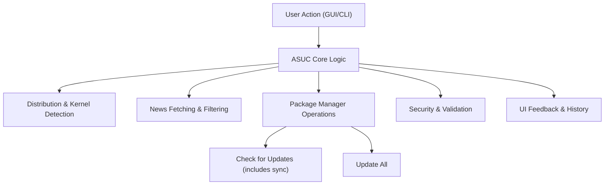
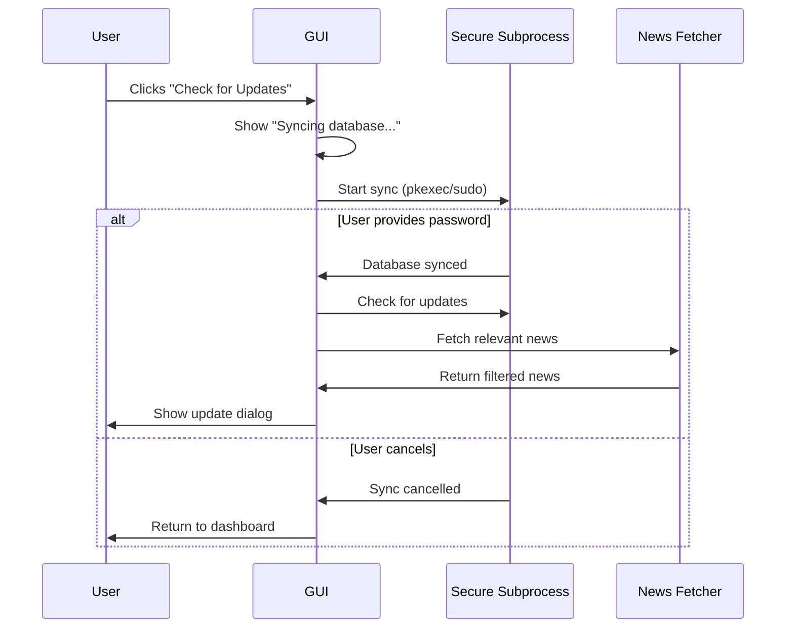

# HOW_ASUC_WORKS.md

## Overview

Arch Smart Update Checker (ASUC) is a security-focused update manager for Arch Linux and its derivatives. It provides both a modern GUI and a CLI, helping users stay informed about important news and advisories before updating their system. ASUC is designed to be safe, robust, and user-friendly, with advanced detection, news filtering, and secure update mechanisms.

---

## High-Level Architecture

---

## Key Components

| Component                | Description                                                                 |
|--------------------------|-----------------------------------------------------------------------------|
| **GUI (Tkinter)**        | Main user interface, dashboard, quick actions, news, and update history     |
| **CLI**                  | Command-line interface for advanced/automated use                           |
| **Distribution Detector**| Detects your Linux distribution and kernel for tailored news/updates        |
| **News Fetcher**         | Downloads and filters news relevant to your installed packages              |
| **Package Manager**      | Interfaces securely with `pacman` for all package operations                |
| **Security Layer**       | Input validation, subprocess sandboxing, authentication, and audit logging  |
| **Thread Manager**       | Runs long operations in the background to keep UI responsive                |

---

## What Happens When...

### 1. **User Clicks "Check for Updates"**

**Goal:** Sync package database and check for available updates with relevant news.

**Step-by-step:**
1. **Progress Indication:** Status bar shows "Syncing package database..."
2. **Authentication:**
   - Uses `pkexec` (polkit) for privilege escalation, which provides a secure GUI authentication dialog.
   - Falls back to `sudo` in terminal mode (CLI) where password input is available.
   - If passwordless sudo is available, uses it directly.
3. **Database Sync:** Runs `pacman -Sy` securely to refresh package database.
4. **Cancel Handling:** If user cancels authentication, returns to dashboard without checking updates.
5. **Update Check:** After successful sync, fetches available package updates.
6. **News Fetching:** Downloads and filters news relevant to installed packages.
7. **Result Display:** Shows available updates with relevant news in a dialog.
8. **Threading:** All operations run in background threads to keep UI responsive.

**Diagram:**

### 2. **User Clicks "Update All"**

**Goal:** Perform a full system upgrade (`pacman -Syu`).

**Step-by-step:**
1. **Confirmation Dialog:** User is warned this will update all packages.
2. **Progress Dialog:** Shows real-time update output.
3. **Authentication:** Uses `pkexec` or `sudo` as with sync.
4. **Command Execution:** Runs `pacman -Syu --noconfirm` securely.
5. **Output Streaming:** All output is shown live in the dialog.
6. **Result Handling:**
   - On success: UI updates, update history is recorded.
   - On failure: Error is shown, with troubleshooting hints.
7. **Threading:** Runs in a background thread for safety and responsiveness.

---

## When is Update History Recorded?

Update history in ASUC is recorded automatically after updates, so you always have an audit trail of what changed on your system.

**Update history is recorded after:**
- **A successful full system update** (when you click "Update All" or run a system upgrade via the GUI/CLI).
- **Selective package updates** (when you apply updates from the updates/news screen).

**How it works:**
- After the update process completes, ASUC parses the output to determine which packages were actually updated (excluding reinstalls).
- It collects version information (old/new) for each updated package when possible.
- A new history entry is created, including:
  - Timestamp
  - List of updated packages
  - Success/failure status
  - Exit code
  - Duration of the update
  - Version info (if available)
- This entry is saved to the update history file in your config directory.
- The update history panel in the GUI is refreshed to show the new entry immediately.

**Note:** If no packages were actually updated (e.g., only reinstalls), no history entry is recorded.

---

## Security and Safety

- **No Shell Execution:** All system commands are run as arrays, never as shell strings, preventing injection.
- **Input Validation:** All user and system inputs are sanitized.
- **Authentication:** Uses polkit (`pkexec`) or `sudo` with password prompt fallback, never stores passwords.
- **Thread Management:** All long-running or privileged operations are run in managed background threads.
- **Audit Logging:** Security events and errors are logged for troubleshooting.
- **AppArmor/SELinux:** Optional security profiles are provided for advanced users.

---

## Update and News Matching Logic

- **Package Extraction:** Uses pattern matching to find package names in news items.
- **Relevance Filtering:** Only news affecting packages you have (and that have updates) is shown.
- **Distribution Awareness:** News feeds are tailored to your detected distribution:
  - On first run, distribution-specific RSS feeds are automatically added:
    - **Manjaro**: "Manjaro Announcements" and "Manjaro Stable Updates" feeds
    - **EndeavourOS**: "EndeavourOS News" feed
  - These feeds are only added during initial setup to respect user preferences
  - Users can freely add/remove feeds after installation without them being re-added

---

## Example Table: Authentication Fallbacks

| Scenario                | Method Used         | User Prompted? | Notes                                 |
|-------------------------|---------------------|----------------|---------------------------------------|
| GUI with polkit         | pkexec              | Yes            | Default, most secure, works on all kernels |
| CLI/Terminal mode       | sudo                | Yes            | Terminal password prompt              |
| Passwordless sudo       | sudo (no password)  | No             | Used if available                     |
| No polkit agent         | Error shown         | N/A            | User is told how to fix               |

---

## Summary

ASUC is designed to be both powerful and safe. It keeps you informed about important news before you update, detects your system details automatically, and always runs privileged operations securely. All heavy work is done in the background, so the app stays responsive and user-friendly.

---

*For more details, see the source code or reach out via GitHub Issues!* 